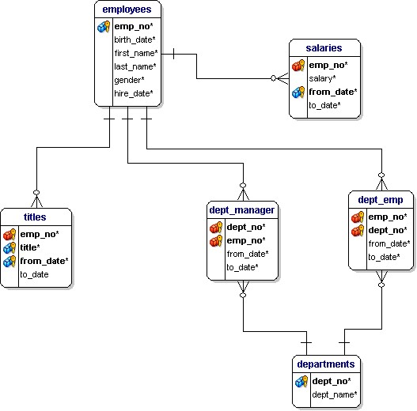

# MySQL


[TOC]

## Introduction

This repo is designed to get you up and running with MySQL in a limited amount of time to get some rapid hands-on experience with the technology through the convenience and reproducibility of a Docker container.

No knowledge of Docker is required but you do need to have Docker desktop installed and some basic understanding of working in a terminal.

[Download Docker Desktop](https://www.docker.com/products/docker-desktop)


## MySQL Version

The MySQL version for this exercise is locked in at 8.0.21 to ensure that this will always work, which shows the magic of Docker. If we were to always use the latest version available on Docker Hub, we may find that some of these steps may not work as there may have been breaking changes.

For more information, review the Dockerfile in this repo and the Docker hub page for MySQL. 

[Docker Hub - MySQL](https://hub.docker.com/_/mysql?tab=description)


## A Note About Security

The instructions and methods used here do not necessarily employ best practices around security and deployment. 

**Please consult the official documentation for best practices around deploying MySQL securely in your environment of choice**. 

In short, this repo should be used to play around with and learn a technology but nothing else.


## About the Data

Data for this exercise has been retrieved from the following Github repo: [DataCharmer](https://github.com/datacharmer/test_db/)

The data is fictional and any resemblance to real people is purely coincidental (see the README in the /data directory) 

The database itself contains information about employees, their titles, who their managers are, what department they work in and what their salaries are. Example queries will be provided so you can see the syntax and learn how to join data together to gain additional context.

You can see how this is represented in the ERD (Entity Reference Diagram) below.



---


## Getting Started

Assuming you have Docker Desktop installed and working on your local machine, we can begin by cloning this repository to your machine.

Clone this repository to your machine from the command line in your terminal.

```bash
git clone https://github.com/nelsonic1/databases-up-and-running.git
```

Change directory to Relational/MySQL.

```bash
cd Relational/MySQL
```

Build the image from the Dockerfile

```bash
docker build -t mysql-test .
```

Review the images available on your machine

```bash
docker image ls
```

### Run the Container

Assuming you see **mysql-test** available in your images, we can now go ahead and run the container.  

```bash
docker run -d -p 3306:3306 --name mysql-test -e MYSQL_ROOT_PASSWORD=secretpwd mysql-test
```

> Options

> > -d detached mode  

> > -p mapping ports from container to host machine  

> > --name giving the container a name for easy reference  

> > -e set an environment variable for the container build


**Tail the Logs**

If you wish to tail the logs while the container is built and started for the first time (depending on where the process is when you run this command, you may need to keep spamming it to see updates)

```bash
docker logs mysql-test --tail all
```

You can now see if the container is running

```bash
docker ps | grep mysql-test
```


### Getting a Bash Shell

Review where the MySQL data lives on disk by getting a Bash shell on the container machine.

(note: you should be able to see the 'employees' database directory that was loaded with the container - feel free to explore)

```bash
docker exec -it mysql-test bash && cd /var/lib/mysql/ 
```

Exit the bash terminal once you're done poking around  

```bash
exit
```


### Getting a MySQL Client on the Command Line

You can get access to the MySQL command line client by executing the following.

```bash
docker exec -it mysql-test mysql -uroot -p
```

> Options

> > -it : allows you to interact with the container and to get a shell (interactive/tty)  

> > -u : specify the username for the mysql prompt  

> > -p : specify that mysql client should prompt you for a password on login


### Accessing the Container through an External Application (Workbench/Data Grip, etc)

You can access the database in the docker container from a client on your local machine such as MySQLWorkbench or Data Grip, etc by specifying the host as `0.0.0.0` and port as `3306`

There are two users that are configured to have access from any host and those are `root` and `guest` which was initialized during the container creation (see `/data` directory in this repo in `init_users.sql`). The password for guest is `guestpwd`. The `guest` user only has full privileges on the `employees` database.

You can review the users created by issuing the following sql:

```mysql
SELECT host, user FROM mysql.user;
```

```mysql
SHOW GRANTS FOR 'guest'@'%';
```


## Sample Queries

Get a list of all departments in the database

```mysql
SELECT * FROM employees.departments d
```


Show the highest paid employee in the company

```mysql
SELECT e.emp_no,
       e.first_name,
       e.last_name,
       s.salary,
       e.hire_date,
       YEAR(e.hire_date) - YEAR(e.birth_date) as 'age_at_hire',
       e.birth_date,
       YEAR(CURRENT_DATE()) - YEAR(e.birth_date) AS 'emp_age'
FROM employees.salaries s
JOIN employees.employees e ON e.emp_no = s.emp_no
ORDER BY s.salary DESC
LIMIT 1
```


Show the most frequent employee last names in descending order

```mysql
SELECT e.last_name, 
       COUNT(e.last_name) AS 'last_name_count' 
FROM employees.employees e
GROUP BY e.last_name
ORDER BY last_name_count DESC;
```


The most frequent last name in the company is "Baba" so let's take a look at all of those employee records

```mysql
SELECT * FROM employees.employees WHERE last_name = 'Baba';
```


Let's take a look at the distribution of the departments that the Baba's work in

```mysql
SELECT d.dept_name,
       e.last_name,
       COUNT(de.emp_no) AS 'emp_dept_count'
FROM employees.employees e
JOIN employees.dept_emp de ON de.emp_no = e.emp_no
JOIN employees.departments d ON d.dept_no = de.dept_no
WHERE e.last_name = 'Baba'
GROUP BY d.dept_name, e.last_name
ORDER BY emp_dept_count DESC;
```


Now, let's find out the minimum, maximum and average age of all employees with the last name Baba.

```mysql
SELECT MIN(emp_age) as min_baba,
       MAX(emp_age) as max_baba,
       ROUND(AVG(emp_age), 2) as avg_baba
FROM (
    SELECT YEAR(CURRENT_DATE()) - YEAR(birth_date) AS 'emp_age'
    FROM employees.employees
    WHERE last_name = 'Baba'
) AS a;
```


## Teardown

To stop the MySQL container you can run  

```bash
docker stop mysql-test
```

To start the MySQL container you can run 

```bash
docker start mysql-test
```

To remove the MySQL container to regain your disk space you can run  

```bash
docker rm -f mysql-test
```

To remove the image

```bash
docker image rm mysql-test
```


## Next Steps

This really just scratches the surface and there is so much more to learn about MySQL. So far, we have looked at a diagram and wrote some queries to learn more about the data contained in the dataset. In a sense, we've put the key in the ignition and started the car but we haven't left the driveway. 

As a recommendation on some next steps, you could try to write some insert/update/delete statements against the database. If you goon the data, you can always just destroy the container and rebuild it!

Additionally, I would recommend you to learn how to create your own database with a number of tables employing a large variety of data types and include foreign keys, unique constraints, triggers, indexes, functions, views, and partitions, etc. You could also learn more about MySQL administration. Your best bet is to figure out what you want to do and find some resources that teach what you want to implement and try to whip up your own version using this container.

A good opportunity to learn more is through the documentation here: [Official MySQL 8.0 Documentation](https://dev.mysql.com/doc/refman/8.0/en/)

